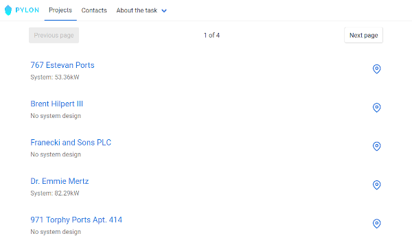

# Pylon Interview Challenge

**Welcome**

Thank you for taking part in this coding exercise!
We're looking forward to seeing how you complete the tasks.

1. Clone this repository or download the source
2. Follow the steps in [Setup](#setup) to get the application running on your machine
3. Get familiar with the application code - [A tour of the application](#a-tour-of-the-application)
4. Complete the [Tasks](#tasks)
5. Submit your modified code as a zip file to daniel@getpylon.com
6. We will get back to you with outcomes and feedback as soon as possible

> **Before submission** please make sure you delete `backend/vendor` and `frontend/node_modules`.
> We do not need those directories and they take up a lot of space, making submissions slower!

If you have any issues during setup, please contact daniel@getpylon.com immediately! We know how many issues can arise when trying to get someone else's code running and don't want you getting stuck on it unnecessarily.

And please reach out to Daniel if any of the tasks are unclear or you need some assistance.

**Screenshot of the demo application**



**Contents of this readme**

<!-- MDTOC maxdepth:6 firsth1:2 numbering:0 flatten:0 bullets:1 updateOnSave:1 -->

- [Setup](#setup)   
   - [Using Docker Compose](#using-docker-compose)   
   - [Without Docker](#without-docker)   
      - [Requirements](#requirements)   
      - [Running the backend](#running-the-backend)   
      - [Running the frontend](#running-the-frontend)   
- [A tour of the application](#a-tour-of-the-application)   
   - [Overview](#overview)   
   - [Backend](#backend)   
      - [Browsing the API](#browsing-the-api)   
      - [Routes](#routes)   
      - [Models and Resources](#models-and-resources)   
      - [Tests](#tests)   
   - [Frontend](#frontend)   
- [Tasks](#tasks)   
   - [1. Contacts update API (backend bug fix)](#1-contacts-update-api-backend-bug-fix)   
   - [2. Contacts list (frontend bug fix)](#2-contacts-list-frontend-bug-fix)   
   - [3. Bulk project delete API (new backend feature)](#3-bulk-project-delete-api-new-backend-feature)   
   - [4. Edit project page (new frontend feature)](#4-edit-project-page-new-frontend-feature)   

<!-- /MDTOC -->

## Setup

We have provided a Docker Compose based setup for the frontend and backend of this application.
If you already have `docker-compose` installed, it should be really easy to run.

If you don't want to use docker, skip down to [without docker](#without-docker) and follow the instructions.

These instructions have been tested with Linux (Ubuntu) and OSX.
We haven't tested this on Windows, but we hope the Docker Compose setup should work there!

### Using Docker Compose

In a terminal in this directory, bring up the docker compose services:

```bash
docker-compose up -d
```

The first time you run this, both services will need to install dependencies.
You can watch the logs of this happening with

```bash
docker-compose logs -f
```

When you have seen both these messages, the app will be ready to use:

```
backend_1  | Laravel development server started: http://0.0.0.0:11111

frontend_1  |   App running at:
frontend_1  |   - Local:   http://localhost:11112/
```

You can then view the frontend by visiting <http://localhost:11112>.

### Without Docker

#### Requirements

- [Install PHP](https://www.php.net/manual/en/install.php) (at least 7.1)
- [Install Composer](https://getcomposer.org/doc/00-intro.md)
- [Install Node and NPM](https://nodejs.org/en/download/) (we recommend Node 12)

#### Running the backend

The `entrypoint.sh` script will perform all first-time setup for you:

```bash
cd backend
./entrypoint.sh
```

Once the script has run, open <http://localhost:11111/api/solar_projects> in your browser to verify the server has installed correctly.

#### Running the frontend

The frontend also has an entrypoint script:

```bash
cd frontend
./entrypoint.sh
```

You'll need to run this in parallel with the backend script (i.e. in a separate terminal).
Once the installation has finished, open <http://localhost:11112> to verify the application has built correctly.

## A tour of the application

### Overview

The example application is a very simple solar project management tool.
The application keeps a list of your solar design projects, and a list of your contacts.
Contacts might be customers, your salespeople, or installer subcontractors.

Projects and contacts have a many-many relationship between them; it's not uncommon for customers to order multiple commercial solar systems if they manage more than one building, and of course your salespeople and installers might be assigned to more than one project.

The application as it stands can do a few things:

- Show a list of solar projects
- Show the details of a solar project and the contacts assigned to it
- Delete a project

The API is capable of more actions, but the frontend doesn't have everything implemented yet.

### Backend

The backend server is implemented using Laravel 6.
It is backed by a SQLite database to make it easier to run locally.
(If you want to browse the contents of the database after running the backend, e.g. using [DB Browser](https://sqlitebrowser.org/), the file is created in `backend/database/dev.sqlite`.)

#### Browsing the API

We have implemented the backend's API with hyperlinked responses. For example, here's what a response from the `/contacts` endpoint might look like:

```json
{
    "data": [
        {
            "type": "contacts",
            "id": "fe5c6852-bfa1-3c6d-9fb6-1ce730f45981",
            "links": {
                "self": {
                    "href": "http://localhost:11111/api/contacts/fe5c6852-bfa1-3c6d-9fb6-1ce730f45981"
                }
            }
        },
        {
            "type": "contacts",
            "id": "bbd3e9ec-4a67-37b9-baa4-4b210bcf54b9",
            "links": {
                "self": {
                    "href": "http://localhost:11111/api/contacts/bbd3e9ec-4a67-37b9-baa4-4b210bcf54b9"
                }
            }
        }
    ]
}
```

The `self` links can be followed to view the attributes of an individual contact.
If you have a JSON viewer browser addon, you should be able to click through these links and browse the API for yourself.

While this isn't fully [HATEOAS](https://apisyouwonthate.com/blog/rest-and-hypermedia-in-2019/), it's a good start!

#### Routes

In order to see the routes defined for the backend API, run this command:

```bash
docker-compose exec backend php artisan route:list
```

(If you're not running the backend in docker, you should of course omit everythng before `php`.)

Most of these routes are defined in `backend/routes/api.php`.
From there, you can look up the relevant controller classes.
(Files are [named after the class they contain](https://www.php-fig.org/psr/psr-4/), so in order to find e.g. a controller class like `ContactsController`, searching for a file with the name `ContactsController.php`.)

[Route model binding](https://laravel.com/docs/6.x/routing#route-model-binding) is used extensively in our API controllers.
For example, the following method:

```php
public function show(Contact $contact)
```

Because `Contact` is type-hinted, will look for a route variable named `contact` (after the parameter's variable name) and try to find this database model and inject it into the controller.

#### Models and Resources

Models (in the `backend/app/Models` folder) are used by the Eloquent ORM to interact with database tables.
They contain relationships and other logic related to the database structure.

You'll notice that the controllers use a combination of Models and Resources to serve responses from the API.
For example:

```php
    $contact = Contact::create($data);
    return new ContactResource($contact);
```

The Resource classes are responsible for rendering a Model in an appropriate way for the API.
Think of them as like Blade templates but for JSON responses.
Read more about them [here](https://laravel.com/docs/6.x/eloquent-resources).

#### Tests

We have a small test suite that lives in `backend/tests/Feature`.
It covers some of the existing API.
Run the tests with the command:

```bash
docker-compose exec backend composer test
```

Tests run against your existing database, so be aware that some of your data may be altered.

If you wish to reset your database with fresh random data, run:

```bash
docker-compose exec backend php artisan migrate:fresh
docker-compose exec backend php artisan db:seed
```

See the `backend/database/seeds` and `backend/database/factories` directories for the code that generates sample data.

### Frontend

The frontend is a very small Vue application.
Start in `frontend/index.js` and follow the imports to discover the components that make the application work.

The application is built and served using the [Vue CLI](https://cli.vuejs.org/).
If everything goes well you won't have to worry about how it does that!
Hot reloading should work out of the box.

## Tasks

We estimate these tasks should take **4-5 hours**.
Task 5 is significantly more complex than 4, so only attempt it if you have time left.

We won't be evaluating you just on your completion rate; we'd like to see quality code and thoughtful comments.
If you find yourself working beyond the 4 hour mark, feel free to just write down the way you would approach the tasks even if the code isn't written.
This might include method stubs, etc.

The first two tasks (bug fixes) are intended to help you start finding your way around the codebase in a practical way.

Tips:

- If you know you're deliberately skipping something you think is relevant, a complicated edge case, etc., leave a TODO comment.
- Comment your code a little more than you usually would; we'd like to see some of your thought process as you design solutions!
- Don't refactor the existing application structure; try to work within it as much as possible.
- You don't have to add additional tests that aren't mentioned in the requirements.
- On the frontend, don't worry about compatibility with browsers that aren't the latest Chrome or Firefox. Write modern JavaScript and assume code will be transpiled appropriately.

### 1. Contacts update API (backend bug fix)

- When attempting to update a single contact using a PUT request, the `last_name` property is never updated
- Add a failing test for this scenario, then fix the backend code so the test passes

This API is not used from the frontend until/unless you complete the extended Task 4, so you can proceed with frontend tasks first if you prefer!

### 2. Contacts list (frontend bug fix)

- Currently, at <http://localhost:11112/contacts>, contacts "fill up" the table incrementally. We would prefer if they all appeared together
- Rewrite the `fetchContacts` method in `ListContacts.vue` so that contacts are only displayed once _all_ contacts have been fetched from the API
- You may choose to continue using `async`/`await` syntax, or just use Promises

The frontend has two main list views, the list of projects and the list of contacts.
They are similar in that they both fetch a list of objects from the server, making AJAX requests to the API for each item.
However, we wish for them to behave _slightly_ differently.

The projects view loads up each item and renders it as soon as possible, resulting in the list "filling up" as AJAX requests finish.
The contacts view does the same, but because it is laid out using a table, the rows "filling up" cause the column widths to wiggle in an ugly way.
We'd much rather than the contacts view loads all items at the same time, so contacts will appear "as a block" rather than "filling up".

This requires changing the code in the `fetchContacts` method in `ListContacts.vue`.
We tried to make it wait for all contacts to finish their AJAX requests before assigning them all to `this.contacts` on the final line of the method, but for some reason the contacts still "fill up" the table one at a time!

Please fix this method so that the contacts _all_ appear at the same time.
Your code should perform the requests to individal contact endpoints _in parallel_, so that each request doesn't wait for the preceding requests to finish.

Note that this is an example of a "1+n" request pattern: 1 request to the list endpoint, and _n_ requests for the individual contacts.
This pattern _can_ be bad for performance, but it keeps the API simple and aids cacheability.
Have a read of [this article](https://evertpot.com/h2-parallelism/) for more information.

### 3. Bulk project delete API (new backend feature)

- Implement an API that can "bulk delete" projects with a constant number of AJAX requests (not necessarily 1 request, but fewer than _n_ requests for _n_ projects!)
- Implement a test for this API in the `backend/tests/Features` directory. The test must perform the HTTP request to the API, and then check that the appropriate records have been deleted in the database after the request has completed
- Implement a test for failing behaviour as described below (e.g. attempting to delete a nonexistent project)
- _Don't_ implement a frontend for this feature

In order to support more convenient API usage, we want to introduce a 'bulk delete' ability.
Bulk operations in REST APIs are a contentious issue with no clear solution.
We're keen to see what you come up with!

Our desired solution will:

- be atomic, so that either all specified records will be deleted or none will;
- fail with a 422 status code and an appropriate [response](https://symfonycasts.com/screencast/rest/application-problem#the-application-problem-json-content-type) if any of the given projects are already deleted, or do not exist;
- perform fewer than _n_ database statements;
- be justified with a few brief sentences or bullet points in the comments. For example: how did you choose your route/method combination? How did you decide on a data format for the request body, if any?

The `SolarProject` model uses [soft deletion](https://laravel.com/docs/6.x/eloquent#soft-deleting), so you don't need to worry about deleting related rows in other tables; the project will remain in the database with its `deleted_at` date set so it doesn't appear in ORM queries.

### 4. Edit project page (new frontend feature)

- There is an 'edit project' link from the individual project page; implement the route and component that will allow the user to edit the project's properties
- All the server API endpoints to update projects using PUT (whole resource) or PATCH (partial update) are already implemented
- Note that the `system_size` field must be saved as a number or `null` (allowing the user to remove the size)

### 5. Bonus challenge - contacts editor (new frontend feature)

- Implement contact editing on the project edit page (edit contact details, remove contact from project, add new contact)
- This must be able to edit all contacts at the same time as the project details, and have a single 'save' button to perform all modifications to the objects
- Don't implement a new 'bulk save' API on the server; use the existing API endpoints
